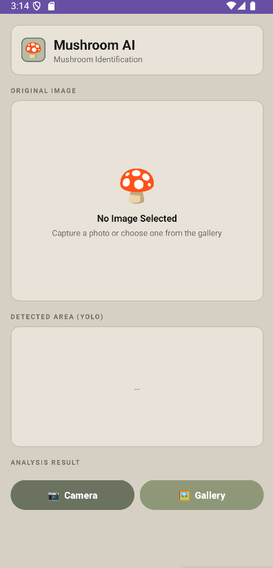
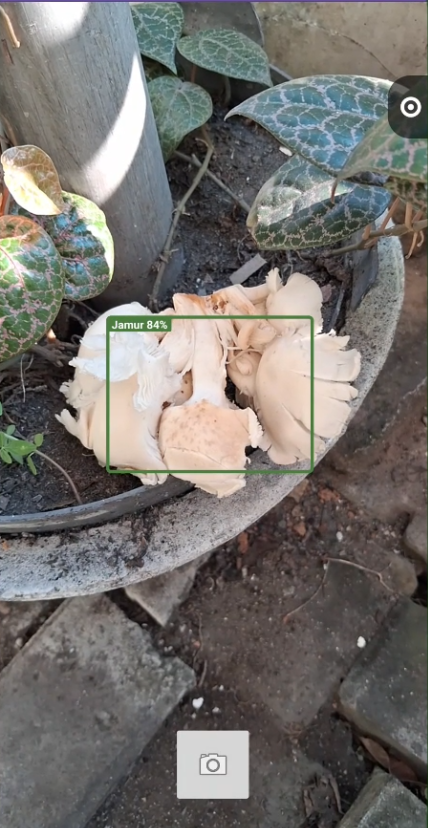
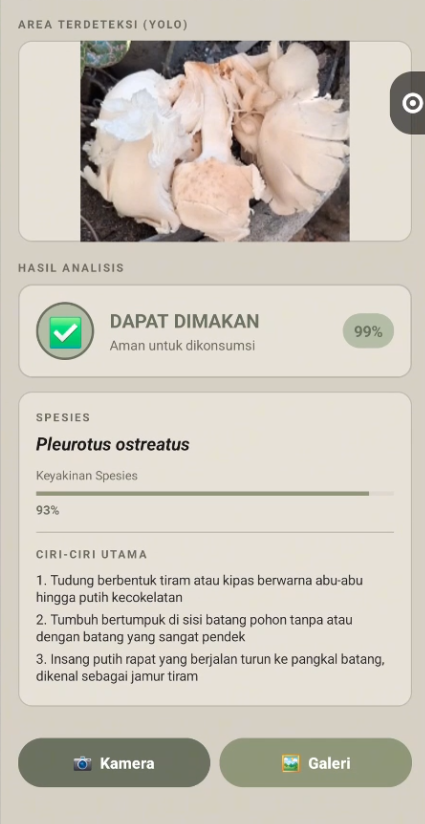

# Mushroom Classification and Detection using Deep Learning 🍄

## Overview

This project focuses on developing an AI-based system to classify poisonous and non-poisonous mushrooms using Deep Learning techniques.

The system combines CNN and Transfer Learning for mushroom classification, along with YOLOv8 Object Detection to detect mushroom objects from images.

The trained deep learning models are integrated into a mobile application to provide AI-based mushroom prediction.

---

## 📱 Mobile Application Demo

  
  
  

The mobile application allows users to capture mushroom images and receive real-time AI classification results.

---

## 🔄 System Workflow
Input Image
↓
YOLOv8 Object Detection
↓
Mushroom Object Localization
↓
CNN / Transfer Learning Classification
↓
Poisonous or Non-Poisonous Prediction
↓
Mobile Application Result

---

## Methods

- YOLOv8 Object Detection
- Convolutional Neural Network (CNN)
- Transfer Learning
- Image Processing
- Deep Learning Model Deployment

---

## Model Architecture

### 🍄 Mushroom Classification

Transfer Learning models:

- ResNet50
- MobileNetV2

### 🎯 Mushroom Detection

Object Detection model:

- YOLOv8

---

## 📊 Model Performance

### YOLOv8 Mushroom Detection

The YOLOv8 model was trained to detect mushroom objects from images.

| Metric | Score |
|---|---|
| Precision | 0.932 |
| Recall | 0.918 |
| mAP50 | 0.954 |
| mAP50-95 | 0.836 |

### ResNet50 Mushroom Classification

Best classification performance achieved using ResNet50 Transfer Learning.

| Metric | Score |
|---|---|
| Binary Classification Accuracy | 94.86% |
| Species Classification Accuracy | 89.97% |
| Test Loss | 0.4477 |

---

## Features

- 🍄 Mushroom object detection
- 🔍 Poisonous and non-poisonous mushroom classification
- 📱 Mobile-based AI prediction
- 🤖 Deep learning inference using trained models
- 📷 Image-based mushroom recognition

---

## Technologies

### 🤖 Artificial Intelligence

- Python
- TensorFlow
- Keras
- OpenCV
- YOLOv8

### 🏷️ Data Annotation & Processing

- Roboflow

### 📱 Mobile Development

- Kotlin
- Android Studio

### 🛠️ Development Tools

- Git
- GitHub
- Google Colab

---
